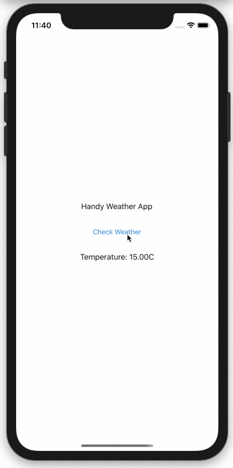
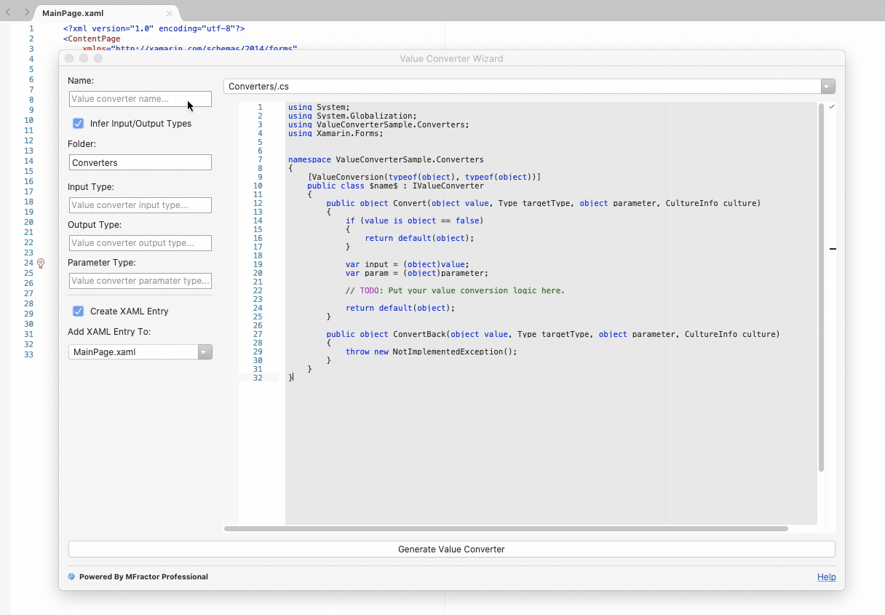
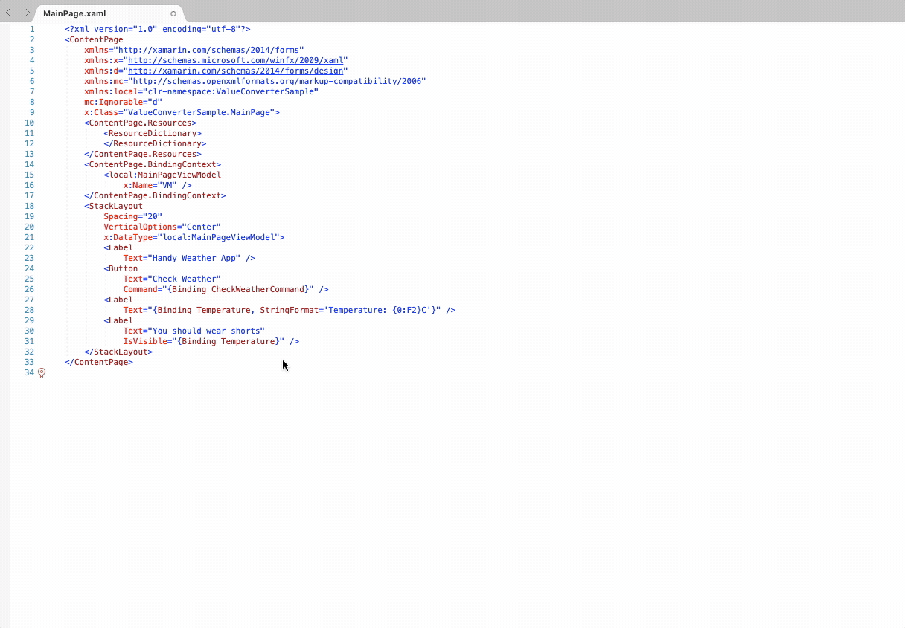
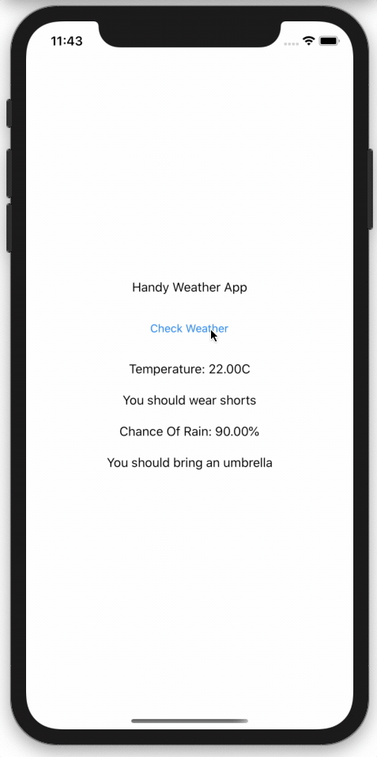
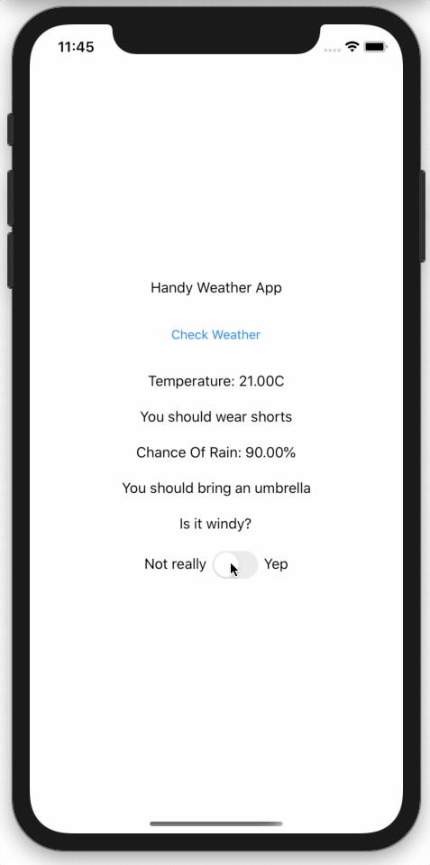

# Using Value Converters To Clean Up Your Xamarin.Forms MVVM Bindings

When working with Data Binding in Xamarin.Forms you can often end up with a property in your ViewModel that's of the wrong type or needs to be converted. 

Maybe you've got `double` for a total and you want a field to change colour if it's negative, or an `enum` that should be displayed as a user friendly string.

Another classic example is when you have a boolean property `IsBusy` that you bind your ActivityIndicator too but you want another element to only appear when not busy. An obvious approach to take, is to use another property called `IsNotBusy` but then you've got the data in two spots that you need to worry about updating and making sure you `NotifyPropertyChanged` for both. This is also not very reusable if you want to bind to the inverse value of a boolean multiple places in your app.

A Value converter sits in between your View and ViewModel and converts the data into the format you need by running a method each time the property is set or accessed.
 
## Let's do it
Using a value converter typically involves three steps
1. Writing a value converter
2. Declaring it as a static resource
3. Consuming it in your views.

Let's say we're working on a weather app and we want to decide if it's warm enough to wear shorts. 



The ViewModel has a property: 

```
public double Temperature {get;set;}
```

In our View we'll have a label that should only be visible if it's warm.
```
<Label Text="You should wear pants" IsVisible={Binding Temperature} />
```

Binding a `bool` property in the view to a double in the ViewModel isn't going to work without a converter. So let's write one.

### Step 1 - The Converter.
We start by making a class for our value converter and have it implement `IValueConverter`. You'll end up with a skeleton class that looks like this:

```
public class DoubleToBoolConverter : IValueConverter
{
    public object Convert(object value, Type targetType, object parameter, CultureInfo culture)
    {
    ...
    }

    public object ConvertBack(object value, Type targetType, object parameter, CultureInfo culture)
    {
    ...
    }
}
```

We've got one method that converts a value and another that converts it back. In our case we'll want to return a `bool` based on the input `double` value which all happens in the Convert() method.  Unfortunately this method isn't type safe so we'll have to do a couple of type checks, and then assuming it is a `double`, return the appropriate value.


```
public object Convert(object value, Type targetType, object parameter, CultureInfo culture)
{
    //Check if the value is a bool,
    if (value is double == false)
    {
        //This only happens if we try to use this converter 
        //on a property in our view model of a different type.
        return default(Color);
    }

    var input = (double)value;

    //We can now safely perform calculations with our `input`
    return input > 25;
}
```

### Step 2 – Static Resource.
The next step is to add the converter as a `StaticResource` so that our xaml properties know where to find it. Just like any `StaticResource` you have the choice of adding it to your App.xaml if you plan to use this resource on multiple pages or in the page's resource dictionary if you don't plan to use it elsewhere. Let's just add it to one page for now.

In our resources we add:

```
<converters:DoubleToBoolConverter x:Key="doubleToBoolConverter"/>
```
And add the namespace to our ContentPage
```
xmlns:converters="clr-namespace:ValueConverterSample.Converters"
```

### Step 3 – Consumption
The final step is to update our Binding in the view to use the converter from our StaticResource.

```
<Label Text="You should wear pants" IsVisible={Binding Temperature, Converter={StaticResource doubleToBoolConverter}} />
```


Right now I'm guessing you're thinking something along the lines of "But that's so much boilerplate and syntax to remember! Do I have to write that every time". Thankfully, the answer is no.

## The MFractor Value Converter Wizard

 MFractor can set up your class, look after your type checking and wire up the resources so you only need to write the logic of the converter and then get back to the fun stuff.

Click the MFractor Menu, then Wizards, ValueConverterWizard

In the name box we enter in a name for the converter `DoubleToBoolConverter`



`Infer Input/Output types` is checked by default so from the name it has worked out our types. In the preview we can see it uses these types to check the input and set up a default output. It also sets up `[ValueConverterAttribute]` which helps analyzers check usage of the converter and the types.

In the `Add XAML Entry To:` drop down MainPage.xaml is selected by default because I had the page open. You can also select App.xaml if you want your resource available to all pages.

Click `Generate Value Converter` and we're done. The value converter is mostly written for your, the StaticResource is set up and the converters namespace is even added to your page.
 
 
## Generate Value Converter from Code Action

 The wizard is great but if you're working away on a xaml file and you suddenly discover you need a converter, you can also generate a converter from the right click menu. You'll find it in the `MFractor Code Actions menu` alongside any other relevant actions. Clicking the action will open up the wizard with all values filled out already with a name based on the types detected in the binding.


 
Accessing the wizard from your xaml not only lets MFractor know the details of your converter so it can fill out the fields for you, it also means the new converter is applied to your binding automatically.

## Benefits for MVVM 
ValueConverters don't require you to follow an MVVM pattern but they do work really nicely together and help to keep your view models clean and easier to read.

Some of the benefits for your view models include:
 * No colors in your view models. Their presence here is up for debate but if you want to cut down on how much `V` is in your `VM` these can be some of the hardest parts to separate out without ValueConverters
 * Remove getters for derived fields
 * Remove complex getters setters where values are linked e.g. IsBusy/IsNotBusy
 * Reduce calls to OnPropertyChanged() by allowing you to bind multiple view properties to one view model property.
 
## Parameters 
 Sometimes a value converter needs input from the view to provide context, this is where the `ValueConverterParameter` comes in handy.

 In our weather example from before the ValueConverter always uses 30 as the threshold to decide between true and false. It would be a whole lot more useful and reusable if this value could be provided by the View.

 To extend our weather app, we add a label that lets the user know they should bring an umbrella. We can reuse our converter because once again we want to convert a double to a bool.

 ```
<Label Text="Bring an umbrella" IsVisible="{ChanceOfRain, Converter={StaticResource doubleToBoolConverter}}">
 ```
 
 A little bit of rain doesn't scare me but lugging an umbrella around does, I only want to bring an umbrella if the chance of rain is more than 80%. So we add a `ConverterParameter` of 80.

 ```
<Label Text="You should bring an umbrella" IsVisible="{Binding ChanceOfRain, Converter={StaticResource doubleToBoolConverter}, ConverterParameter=80}" />
 ```

And tweak our converter logic a little.

```
if(double.TryParse((string) parameter, out double threshold))
{
    return input > threshold;
}
``` 


## Convert Back
We've written the `Convert` method but so far the `ConvertBack` method is empty. Quite often a converter only makes sense in a one-way-binding so the `ConvertBack` method is unnecessary.

Let's add another feature to the app. We'll ask the user if it's windy.

Our `ConvertBack` method is very similar to `Convert` but it does the opposite.

```
public object ConvertBack(object value, Type targetType, object parameter, CultureInfo culture)
{
    if (value is bool == false)
    {
        return default(double);
    }

    var input = (bool)value;
    if (double.TryParse((string)parameter, out double threshold))
    {
        return input ? threshold + 5 : threshold - 5;
    }
    return input ? 25 : 15;
}
```

All we can work out from a bool is if it's greater than or less than the threshold so here we just use a magic number and set it to be +/- 5.

The xaml for our `Switch` is very similar to the label but we use the same Converter on `IsToggled` instead of `IsChecked.`

```
<Switch IsToggled="{Binding WindSpeed, Converter={StaticResource doubleToBoolConverter}, ConverterParameter=20}" />
```

Now whenever the switch is toggled it will call the `ConvertBack` method and set the temperature to 15 or 25. When we check the weather again and a new temperature is set the switch will also update with the Temperature going through the Convert method to get a bool for `IsToggled`.

This time our ViewModel property will need a backing field and `OnPropertyChanged` in our setter,  so that when it's set by the switch toggle, our other bindings will update.

```
double windSpeed;
public double WindSpeed
{
    get => windSpeed;
    set
    {
        temperature = value;
        OnPropertyChanged(nameof(WindSpeed));
    }
}
```

 
## Summary
Value converters are one of those neat features in Xamarin.Forms where once you start using them, you won't know how you lived without them. Having your type conversion logic in one reusable place lets you focus on the code that matters without as much noise. Their main drawback is that there is a fair bit of boilerplate to get started but MFractor does all the heavy lifting for you with just a little prompting.


## Resources

All code snippets used in this post are in the sample app on github: [https://github.com/lachlanwgordon/ValueConverterSample](https://github.com/lachlanwgordon/ValueConverterSample)

Official Xamarin Documentation:  
[https://docs.microsoft.com/en-us/xamarin/xamarin-forms/app-fundamentals/data-binding/converters](https://docs.microsoft.com/en-us/xamarin/xamarin-forms/app-fundamentals/data-binding/converters)

## About The Author
Lachlan is a freelance Xamarin developer who has recently been branching out into Blazor. As a co-organizer of the [Blazor and Xamarin Meetup](https://www.meetup.com/Melbourne-Xamarin-Meetup/) he regularly presents on whatever his latest .Net adventure has been. When not writing C# you'll usually find him riding a bike our playing double bass. 

You can find him on Twitter
[@lachlanwgordon](twitter.com/lachlanwgordon), Github [github.com/lachlanwgordon](github.com/lachlanwgordon), LinkedIn [linkedin.com/in/lachlanwgordon](https://www.linkedin.com/in/lachlanwgordon), live coding at [twitch.tv/lachlanwgordon](twitch.tv/lachlanwgordon) and blogging on [lachlanwgordon.com](https://lachlanwgordon.com).
